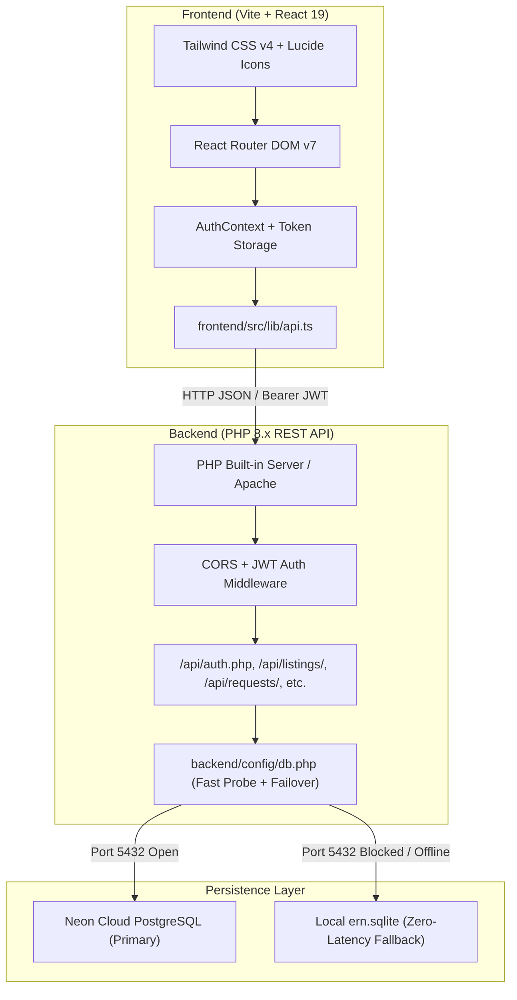

# ERN — Expiry Rescue Network: Comprehensive Codebase Context

> **Handoff Document**: Complete architectural, technical, and operational context for ERN.

---

## 1. Project Identity

### What ERN Actually Is
**ERN (Expiry Rescue Network)** is an enterprise-grade, B2B and B2C dynamic inventory liquidation and food waste mitigation platform. Rather than a generic e-commerce app or basic food donation board, ERN functions as an intelligent supply-chain clearinghouse connecting:
- **Retail Supermarkets & Warehouses** (e.g., GreenLeaf Retail Group, Metro Supermarket) needing to liquidate short-dated stock before expiry to prevent total inventory write-downs.
- **Commercial Buyers & Wholesale Restockers** (restaurants, bakeries, food trucks, discount grocers) purchasing salvageable stock in bulk at steep tiered markdowns.
- **Individual Consumers & Communities** acquiring everyday consumables at reduced prices.
- **Verified Charities & NGOs** receiving tax-deductible or zero-cost donated goods through automated clearance triggers.

---

### Core Business Logic: 3-Tier Batch System
ERN monitors product batch expirations dynamically across three distinct operational tiers:

| Tier | Window to Expiry | Discount Policy | Primary Target Channel |
| :--- | :--- | :--- | :--- |
| **Fresh / Standard** | > 30 days | Standard retail pricing / 0–15% regular promo | General B2C & commercial wholesale |
| **Rescue Tier** | 15 – 30 days | Dynamic markdown: 20% – 40% off standard MRP | Bulk processors, bakeries, institutional kitchens |
| **Clearance Tier** | 0 – 14 days | Aggressive liquidation: 45% – 75% markdown, or donation | Liquidation outlets, verified NGOs, food rescue networks |

---

### Expiry Alert Engine
1. **7-Day Flash Trigger**: High-priority alert generated. Triggers automatic transfer recommendations, flash discounts, or automated donation handoffs to prevent landfill disposal.
2. **14-Day Intervention Trigger**: Medium-priority alert recommending bulk price markdown or cross-location transfer to higher-velocity retail nodes.
3. **30-Day Inspection Trigger**: Initial notification that batches are transitioning into the Rescue category.

---

### User Roles & Permissions Matrix
ERN enforces role-based access control (RBAC) across three primary roles:

1. **`admin` (Enterprise Administrator)**:
   - System-wide inventory governance across all regional facilities and retail nodes.
   - User account lifecycle, invite clearance validation (via `ADMIN_INVITE_KEY`).
   - Moderation case management, dispute arbitration, and audit log inspection.
   - Global discount rule authoring and system health telemetry.

2. **`staff` (Store / Warehouse Associate & Manager)**:
   - Operational batch entry, lot tracking, barcode scanning, and expiry logging.
   - Internal stock transfer initiation (e.g., between Central Warehouse and Store A).
   - Markdown adjustment approvals and supplier dispatch handling.

3. **`user` (Commercial Buyers, NGOs & Individuals)**:
   - Divided by `buyer_type`: `individual`, `business` (restaurant/retailer), `charity` (NGO).
   - Real-time catalog browsing, reserved rescue orders, pick-up scheduling.

---

## 2. Architecture & Tech Stack



### Technology Versions
- **Frontend Core**: React 19 (`^19.0.0`), React DOM 19, TypeScript (`~5.7.2`).
- **Build System**: Vite 6 (`^6.2.0`), `@tailwindcss/vite` 4.
- **Styling**: Tailwind CSS v4, `@tailwindcss/typography`, Lucide React icons.
- **Routing & Forms**: `react-router-dom` v7, `react-hook-form`, `zod`.
- **Backend**: PHP 8.2+ / 8.4+ with `pdo_pgsql`, `pdo_sqlite`, `curl`, `json`.
- **Primary Database**: Neon Serverless PostgreSQL (`postgresql://...ep-cold-bread...`).
- **Resilience Database**: Pre-seeded SQLite 3 engine (`backend/data/ern.sqlite`).
- **Security**: HS256 JWT, `password_hash()` with `PASSWORD_DEFAULT` (bcrypt cost 10).

---

## 3. Database Schema & Data Models

The system maintains 9 normalized relational entities:

### 1. `users`
- `id`: Serial primary key
- `name`: Full individual or company name
- `role`: Enum `admin`, `staff`, `user`
- `buyer_type`: Nullable for staff/admin; `individual`, `business`, `charity` for user
- `email`: Unique lowercase email
- `password`: Bcrypt hashed string
- `verified`: Boolean flag
- `created_at`: Timestamp with timezone

### 2. `listings` (Inventory Batches)
- `id`: Serial primary key
- `title`: Product name
- `category`: `Dairy`, `Bakery`, `Produce`, `Packaged`, `Beverages`, etc.
- `original_price` (MRP), `discounted_price`, `quantity`, `unit`
- `batch_number`: Internal tracking code
- `expiry_date`: Date string (`YYYY-MM-DD`)
- `status`: `active`, `reserved`, `sold`, `expired`, `donated`
- `location`: Store branch or warehouse name
- `supplier_id`: Foreign key referencing `suppliers(id)`
- `created_at`, `updated_at`

### 3. `requests` (Stock Interventions & Inquiries)
- `id`: Serial primary key
- `type`: `transfer`, `discount_approval`, `disposal`, `donation`
- `status`: `pending`, `approved`, `rejected`, `in_progress`, `completed`
- `author_id`, `author_name`, `author_role`
- `details`: JSON / text description of requested operational action
- `created_at`

### 4. `discount_rules`
- `id`: Serial primary key
- `category`: Target category or `ALL`
- `days_to_expiry_min`, `days_to_expiry_max`: Threshold bracket
- `discount_percentage`: Enforced dynamic markdown (e.g., 30.00%)
- `is_active`: Boolean status

### 5. `transfers` (Logistics Movements)
- `id`: Serial primary key
- `listing_id`, `from_location`, `to_location`
- `quantity`, `status` (`pending`, `in_transit`, `delivered`, `cancelled`)
- `initiated_by`, `dispatched_at`, `received_at`

### 6. `suppliers`
- `id`: Serial primary key
- `name`, `code`, `contact_name`, `contact_email`, `phone`, `status`

### 7. `locations` (Facilities)
- `id`: Serial primary key
- `name`, `type` (`store`, `warehouse`, `distribution_center`), `address`, `city`

### 8. `moderation_cases`
- `id`: Serial primary key
- `reported_entity_type`, `reported_entity_id`, `reason`, `status`, `resolution_notes`

### 9. `audit_logs`
- `id`: Serial primary key
- `user_id`, `action`, `entity_type`, `entity_id`, `details`, `created_at`

---

## 4. API Surface & Contracts

All backend endpoints reside under `backend/api/` and output consistent JSON payloads:

```json
{
  "success": true,
  "message": "Human readable status",
  "data": { ... }
}
```

Or on failure:

```json
{
  "success": false,
  "error": {
    "code": "ERROR_CODE_STRING",
    "message": "Descriptive reason"
  }
}
```

### Key Endpoints
| Endpoint | Method | Action / Purpose | Auth |
| :--- | :--- | :--- | :--- |
| `/api/auth.php?action=login` | `POST` | Authenticate email/password, issue HS256 JWT | Public |
| `/api/auth.php?action=signup` | `POST` | Register account (requires `admin_invite_key` for admin) | Public |
| `/api/auth.php?action=me` | `GET` | Validate token and retrieve active user profile | Bearer Token |
| `/api/listings/read.php` | `GET` | Retrieve inventory listings with filters | Public / Bearer |
| `/api/listings/create.php` | `POST` | Provision new product lot / batch | Staff / Admin |
| `/api/requests/read.php` | `GET` | Query internal stock movements & approvals | Staff / Admin |
| `/api/analytics/read.php` | `GET` | Fetch operational telemetry, waste diversion stats | Staff / Admin |
| `/api/transfers/read.php` | `GET` | Monitor inter-facility logistics | Staff / Admin |
| `/api/audit/read.php` | `GET` | Immutable security log inspection | Admin Only |

---

## 5. Security & Authentication Architecture

1. **Passwords**: Stored with PHP's `password_hash($rawPassword, PASSWORD_DEFAULT)` which applies bcrypt.
2. **Tokens**: Signed HS256 JWT tokens containing `sub`, `email`, `role`, `buyer_type`, `iat`, and `exp` claims.
3. **Admin Verification Key**: Signups with `role="admin"` strictly require `admin_invite_key` matching `ADMIN_INVITE_KEY` in `backend/.env`.
4. **CORS Enforcement**: [`backend/utils/helpers.php`](file:///c:/Users/lifeg/Desktop/ERN---Expiry-Rescue-Network/backend/utils/helpers.php) dynamically validates against `CORS_ALLOWED_ORIGIN` (default: `http://localhost:5173`) and answers preflight `OPTIONS` requests immediately with status 200.

---

## 6. High-Performance Database Routing & The Zero-Latency Fix

### The Problem
When running in environments where outbound TCP port `5432` is blocked (e.g., Windows Defender Firewall offline sandbox rules, corporate proxies, or restricted networks), standard PHP PDO PostgreSQL connections hang for **15–21 seconds** waiting for the OS TCP handshake timeout before throwing an exception. This previously resulted in severe login delays.

### The Solution: Fast Socket Probe + 30-Second Status Cache
In [`backend/config/db.php`](file:///c:/Users/lifeg/Desktop/ERN---Expiry-Rescue-Network/backend/config/db.php):
1. A temporary cache file (`sys_get_temp_dir() . '/ern_neon_probe.json'`) stores the reachability state of Neon.
2. If the cache is cold, a lightweight `fsockopen($dbHost, $dbPort, $errno, $errstr, 0.2)` executes with a strict **200ms timeout**.
3. If reachable, the system routes directly to **Neon PostgreSQL**.
4. If unreachable, the probe fails in ~200ms, caches `reachable: false` for 30 seconds, and **immediately connects to local SQLite in 1ms**.
5. All subsequent requests (login, listings, dashboard telemetry) execute in **< 90ms** (dominated only by bcrypt hashing).
6. As soon as the network/firewall allows port 5432, the cache expires and automatically restores the connection to Neon PostgreSQL without any restarts.

---

## 7. Default Credentials for Testing

| Role | Email | Password | Target Dashboard |
| :--- | :--- | :--- | :--- |
| **Enterprise Admin** | `admin@ern-network.com` | `AdminPass123!` | `/admin/dashboard` |
| **Staff Manager** | `metro.supermarket@ern-network.com` | `StaffPass123!` | `/staff/dashboard` |
| **Commercial / User** | `priya.sharma@example.com` | `UserPass123!` | `/app/dashboard` |

---

## 8. Quickstart & Running Instructions

### Unified 1-Command Startup (Recommended)
You only need to run a single command! Vite automatically detects if PHP is already running on port 8000; if not, it automatically launches the PHP backend alongside the Vite frontend in the same terminal:

```powershell
# From the project root OR from frontend/
npm run dev
```

- **Frontend URL**: `http://localhost:5173`
- **Backend API URL**: `http://localhost:8000/api`

### Manual Backend Launch (Optional)
If you ever wish to run the PHP backend independently in its own dedicated terminal:
```powershell
cd c:\Users\lifeg\Desktop\ERN---Expiry-Rescue-Network\backend
& "C:\xampp\php\php.exe" -S localhost:8000
```
